# 💰 余额积分与订阅监控系统

多平台余额与积分监控告警系统，支持实时 Web 界面和定时告警通知。

## ✨ 功能特性

- 🌐 **实时 Web 界面** - 可视化展示所有项目的余额/积分状态
- ⏰ **定时自动检查** - 每天定时运行，自动监控
- 🔔 **智能告警** - 余额/积分不足时自动发送 webhook 通知
- 📅 **订阅续费提醒** - 支持周/月/年三种续费周期，可手动标记已续费
- 📧 **邮箱扫描告警** - 自动扫描多个邮箱，识别欠费/续费等告警邮件
- 🔌 **多平台支持** - 支持火山云、阿里云、OpenRouter、TikHub、微信排名等
- 📊 **灵活配置** - 每个项目独立配置阈值和告警规则
- 🐳 **Docker 部署** - 一键启动，开箱即用

## 🎯 支持的平台

| 平台 | 类型 | 说明 |
|------|------|------|
| 🌋 火山云 (Volc) | 余额 | 支持火山引擎账户余额监控 |
| ☁️ 阿里云 (Aliyun) | 余额 | 支持阿里云账户余额监控 |
| 🤖 OpenRouter | 积分 | 支持 OpenRouter API 积分监控 |
| 🔷 UniAPI | 积分 | 支持 UniAPI 账户积分监控 |
| 📱 微信排名 (WxRank) | 积分 | 支持微信公众号积分监控 |
| 🎬 TikHub | 余额 | 支持 TikHub API 余额监控 |

## 🚀 快速开始

### 方式一：Docker 部署（推荐）

```bash
# 1. 克隆项目
git clone <your-repo>
cd check_credits

# 2. 配置项目
# 编辑 config.json，添加你的项目配置

# 3. 构建并启动
./run.sh build
./run.sh start

# 4. 访问 Web 界面
# 打开浏览器访问: http://localhost:8080
```

### 方式二：本地运行

```bash
# 1. 安装依赖
pip install -r requirements.txt

# 2. 配置项目
# 编辑 config.json

# 3. 运行 Web 服务器
python3 web_server.py

# 或者直接检查一次
python3 monitor.py
```

## 📧 Webhook 配置

系统支持多种 webhook 类型，可以发送告警到不同的平台。

### 支持的 Webhook 类型

| 类型 | 说明 | 配置值 |
|------|------|--------|
| 🟦 **飞书** | 飞书机器人 | `feishu` |
| 🟦 **钉钉** | 钉钉机器人 | `dingtalk` |
| 🟩 **企业微信** | 企业微信机器人 | `wecom` |
| ⚙️ **自定义** | 自定义 JSON 格式 | `custom` (默认) |

### 配置示例

#### 飞书机器人
```json
{
  "webhook": {
    "url": "https://open.feishu.cn/open-apis/bot/v2/hook/your-token",
    "type": "feishu",
    "source": "credit-monitor"
  }
}
```

飞书消息格式：
```json
{
  "msg_type": "text",
  "content": {
    "text": "【余额告警】\n\n项目: xxx\n服务商: xxx\n..."
  }
}
```

#### 钉钉机器人
```json
{
  "webhook": {
    "url": "https://oapi.dingtalk.com/robot/send?access_token=your-token",
    "type": "dingtalk",
    "source": "credit-monitor"
  }
}
```

#### 企业微信机器人
```json
{
  "webhook": {
    "url": "https://qyapi.weixin.qq.com/cgi-bin/webhook/send?key=your-key",
    "type": "wecom",
    "source": "credit-monitor"
  }
}
```

#### 自定义格式
```json
{
  "webhook": {
    "url": "https://your-webhook-url.com/notify",
    "type": "custom",
    "source": "credit-monitor"
  }
}
```

自定义消息格式：
```json
{
  "Type": "AlarmNotification",
  "RuleName": "xxx余额告警",
  "Level": "critical",
  "Resources": [{
    "ProjectName": "xxx",
    "Provider": "xxx",
    "CurrentValue": 1000,
    "Threshold": 5000,
    "Unit": "￥",
    "Message": "..."
  }]
}
```

### 测试 Webhook

```bash
# 测试模式（不发送真实告警）
python3 monitor.py --dry-run

# 实际发送告警
python3 monitor.py
```

---

## 📝 配置说明

### config.json 配置文件

```json
{
  "webhook": {
    "url": "http://your-webhook-url",
    "source": "credit-monitor",
    "type": "feishu"
  },
  "email": [
    {
      "name": "飞书邮箱",
      "host": "imap.feishu.cn",
      "port": 993,
      "username": "your-email@example.com",
      "password": "your-password",
      "use_ssl": true,
      "enabled": true
    }
  ],
  "subscriptions": [
    {
      "name": "订阅名称",
      "cycle_type": "monthly",
      "renewal_day": 15,
      "alert_days_before": 3,
      "amount": 100.0,
      "currency": "CNY",
      "enabled": true
    }
  ],
  "projects": [
    {
      "name": "项目名称",
      "provider": "服务商标识",
      "api_key": "API密钥",
      "threshold": 告警阈值,
      "type": "balance/credits",
      "enabled": true
    }
  ]
}
```

### 配置字段说明

#### 项目配置 (projects)

| 字段 | 必填 | 说明 | 示例 |
|------|------|------|------|
| `name` | ✅ | 项目名称 | "火山云-生产环境" |
| `provider` | ✅ | 服务商标识 | volc / aliyun / openrouter / uniapi / wxrank |
| `api_key` | ✅ | API 密钥 | 各平台的密钥格式见下文 |
| `threshold` | ✅ | 告警阈值 | 低于此值时触发告警 |
| `type` | ⭕ | 类型 | balance(余额) / credits(积分) |
| `enabled` | ⭕ | 是否启用 | true / false，默认 true |

#### 订阅配置 (subscriptions)

| 字段 | 必填 | 说明 | 示例 |
|------|------|------|------|
| `name` | ✅ | 订阅名称 | "OpenAI Plus" |
| `cycle_type` | ⭕ | 续费周期类型 | weekly / monthly / yearly，默认 monthly |
| `renewal_day` | ✅ | 续费日期 | 周周期: 1-7(周一到周日)<br>月周期: 1-31(每月几号)<br>年周期: 1-31(配合 renewal_month) |
| `renewal_month` | ⭕ | 续费月份（仅年周期） | 1-12 (仅当 cycle_type=yearly 时使用) |
| `alert_days_before` | ✅ | 提前多少天提醒 | 3 (提前 3 天) |
| `amount` | ✅ | 续费金额 | 20 |
| `currency` | ⭕ | 货币单位 | "USD" / "CNY"，默认 CNY |
| `last_renewed_date` | ⭕ | 上次续费日期 | "2024-01-15" (手动标记时自动设置) |
| `enabled` | ⭕ | 是否启用 | true / false，默认 true |

#### 邮箱配置 (email)

| 字段 | 必填 | 说明 | 示例 |
|------|------|------|------|
| `name` | ⭕ | 邮箱名称（标识用） | "飞书邮箱" |
| `host` | ✅ | IMAP 服务器地址 | "imap.feishu.cn" |
| `port` | ⭕ | IMAP 端口 | 993（默认） |
| `username` | ✅ | 邮箱账号 | "user@example.com" |
| `password` | ✅ | 邮箱密码或授权码 | "password" |
| `use_ssl` | ⭕ | 是否使用 SSL | true（默认） |
| `enabled` | ⭕ | 是否启用 | true / false，默认 true |

**支持的邮箱服务器**：
- 飞书: `imap.feishu.cn:993`
- QQ邮箱: `imap.qq.com:993` (需开启IMAP并使用授权码)
- 163邮箱: `imap.163.com:993` (需开启IMAP并使用授权码)
- Gmail: `imap.gmail.com:993`
- Outlook: `outlook.office365.com:993`

### API 密钥格式

#### 火山云 (volc)
格式：`AK:SK`（用冒号分隔）
```json
"api_key": "AKLT***:Tmp***"
```

#### 阿里云 (aliyun)
格式：`AccessKeyId:AccessKeySecret`（用冒号分隔）
```json
"api_key": "LTAI5t***:34PXW3***"
```

#### OpenRouter
格式：完整的 API Key
```json
"api_key": "sk-or-v1-***"
```

#### UniAPI
格式：完整的 API Key
```json
"api_key": "sk-***"
```

获取 API Key：
1. 登录 [UniAPI 控制台](https://api.uniapi.io)
2. 进入 API Keys 管理页面
3. 复制 Bearer Token

#### 微信排名 (wxrank)
格式：直接使用 key
```json
"api_key": "a7136e65***"
```

#### TikHub
格式：Bearer Token
```json
"api_key": "mKMARFp0w***"
```

获取 API Key：
1. 登录 [TikHub 控制台](https://api.tikhub.io)
2. 进入 API Keys 管理页面
3. 复制 Bearer Token

### 配置示例

```json
{
  "webhook": {
    "url": "https://open.feishu.cn/open-apis/bot/v2/hook/xxx",
    "source": "credit-monitor",
    "type": "feishu"
  },
  "email": [
    {
      "name": "飞书邮箱",
      "host": "imap.feishu.cn",
      "port": 993,
      "username": "dev@example.com",
      "password": "your-password",
      "use_ssl": true,
      "enabled": true
    }
  ],
  "subscriptions": [
    {
      "name": "OpenAI Plus",
      "cycle_type": "monthly",
      "renewal_day": 6,
      "alert_days_before": 3,
      "amount": 20,
      "currency": "USD",
      "enabled": true
    },
    {
      "name": "GitHub Copilot",
      "cycle_type": "yearly",
      "renewal_day": 15,
      "renewal_month": 3,
      "alert_days_before": 7,
      "amount": 100,
      "currency": "USD",
      "enabled": true
    },
    {
      "name": "每周备份服务",
      "cycle_type": "weekly",
      "renewal_day": 1,
      "alert_days_before": 1,
      "amount": 50,
      "currency": "CNY",
      "enabled": true
    }
  ],
  "projects": [
    {
      "name": "火山云-生产环境",
      "provider": "volc",
      "api_key": "AKLTxxx:TmpBxxx",
      "threshold": 7000,
      "type": "balance",
      "enabled": true
    },
    {
      "name": "OpenRouter-AI服务",
      "provider": "openrouter",
      "api_key": "sk-or-v1-xxx",
      "threshold": 10000,
      "type": "credits",
      "enabled": true
    },
    {
      "name": "TikHub",
      "provider": "tikhub",
      "api_key": "mKMARFp0w***",
      "threshold": 10.0,
      "type": "balance",
      "enabled": true
    }
  ]
}
```

## 🎮 使用方法

### Docker 命令

```bash
# 构建镜像
./run.sh build

# 启动服务（Web + 定时任务）
./run.sh start

# 本地运行 Web 服务器
./run.sh web

# 停止服务
./run.sh stop

# 重启服务
./run.sh restart

# 查看容器日志
./run.sh logs

# 查看定时任务日志
./run.sh cron-logs

# 立即执行一次检查
./run.sh run-now

# 进入容器 Shell
./run.sh shell

# 清理容器和镜像
./run.sh clean
```

### 本地运行命令

```bash
# 启动 Web 服务器
python web_server.py

# 执行一次检查（发送告警）
python monitor.py

# 测试模式（不发送告警）
python monitor.py --dry-run

# 检查指定项目
python monitor.py --project "项目名称"

# 扫描邮箱（检查最近1天的邮件）
python email_scanner.py --days 1

# 扫描邮箱（测试模式）
python email_scanner.py --days 3 --dry-run

# 集成检查（余额+订阅+邮箱）
python monitor.py --check-email --email-days 1
```

## 🌐 Web 界面

启动服务后访问 http://localhost:8080

### 功能特性

- 📊 实时显示所有项目的余额/积分状态
- 📅 订阅管理：添加、编辑、删除订阅
- 🔄 支持手动刷新数据
- ✅ 手动标记订阅已续费/取消标记
- 📈 可视化进度条显示余额比例
- ⚠️ 自动标识余额不足的项目
- 🎨 美观的卡片式布局
- 📧 订阅续费状态一目了然

### 自动刷新

- Web 界面每 **30 秒** 自动刷新一次数据
- 后台每 **5 分钟** 重新查询一次余额
- 可以点击"刷新数据"按钮立即更新

## ⏰ 定时任务

### 默认定时

- 每天 **上午 9:00** 执行检查
- 每天 **下午 15:00** 执行检查

### 修改定时

编辑 `crontab` 文件：

```bash
# 每天 9 点和 15 点运行
0 9,15 * * * cd /app && python monitor.py >> /app/logs/cron.log 2>&1

# 每 6 小时运行一次
0 */6 * * * cd /app && python monitor.py >> /app/logs/cron.log 2>&1

# 每天凌晨 1 点运行
0 1 * * * cd /app && python monitor.py >> /app/logs/cron.log 2>&1
```

修改后重新构建镜像：
```bash
./run.sh stop
./run.sh build
./run.sh start
```

## 🔔 告警机制

### 告警模式

#### 1. Web 模式（默认）
- Web 服务器**仅查询**，不发送告警
- 避免频繁刷新导致重复告警

#### 2. 定时任务模式
- 定时任务会**发送真实告警**
- 按计划定期检查和通知

#### 3. 启用 Web 告警（可选）

如果需要 Web 也发送告警，设置环境变量：

```bash
# 本地运行
ENABLE_WEB_ALARM=true python3 web_server.py

# Docker 运行
# 编辑 docker-compose.yml，添加环境变量
environment:
  - ENABLE_WEB_ALARM=true
```

### Webhook 数据格式

```json
{
  "Type": "AlarmNotification",
  "RuleName": "项目名称余额告警",
  "Level": "critical",
  "Resources": [
    {
      "ProjectName": "项目名称",
      "Provider": "服务商",
      "CurrentCredits": 当前余额,
      "Threshold": 告警阈值,
      "Message": "余额不足，当前余额: xxx, 阈值: xxx"
    }
  ]
}
```

## 📂 项目结构

```
balance-alert/
├── config.json              # 配置文件
├── monitor.py               # 监控主程序
├── web_server.py           # Web 服务器
├── email_scanner.py        # 邮箱扫描器
├── subscription_checker.py # 订阅续费检查器
├── webhook_adapter.py      # Webhook 告警适配器
├── providers/              # 服务商适配器
│   ├── __init__.py
│   ├── volc.py            # 火山云
│   ├── aliyun.py          # 阿里云
│   ├── openrouter.py      # OpenRouter
│   ├── uniapi.py          # UniAPI
│   ├── wxrank.py          # 微信排名
│   └── tikhub.py          # TikHub
├── templates/              # Web 模板
│   └── index.html
├── Dockerfile              # Docker 镜像
├── docker-compose.yml      # Docker Compose 配置
├── docker-compose.web.yml  # 分离部署配置
├── crontab                # 定时任务配置
├── requirements.txt        # Python 依赖
├── run.sh                 # 管理脚本
└── README.md              # 说明文档
```

## 🔧 高级配置

### 自定义端口

编辑 `docker-compose.yml`：

```yaml
ports:
  - "8080:8080"  # 改为 8080 端口
```

编辑 `web_server.py`：

```python
app.run(host='0.0.0.0', port=8080, debug=False)
```

### 添加新的服务商

1. 在 `providers/` 目录创建新文件 `yourprovider.py`
2. 实现 `YourProvider` 类，包含 `get_credits()` 方法
3. 在 `providers/__init__.py` 中注册
4. 在 `config.json` 中添加项目配置

参考现有适配器实现。

## 📊 日志查看

### 容器日志

```bash
# 查看容器实时日志
docker logs -f credit-monitor

# 查看最近 100 行
docker logs --tail 100 credit-monitor
```

### 定时任务日志

```bash
# 查看定时任务执行日志
docker exec credit-monitor cat /app/logs/cron.log

# 实时查看
docker exec credit-monitor tail -f /app/logs/cron.log
```

### 本地日志

日志文件位置：`./logs/cron.log`

## 🐛 故障排查

### Web 界面无法访问

```bash
# 检查容器是否运行
docker ps | grep credit-monitor

# 查看容器日志
docker logs credit-monitor

# 检查端口占用
lsof -i :8080
```

### 告警未发送

1. 检查 `config.json` 中 webhook 配置是否正确
2. 查看日志确认是否触发告警条件
3. 确认不是测试模式（dry_run）

### API 密钥错误

检查各平台密钥格式是否正确：
- 火山云/阿里云：用冒号分隔 AK 和 SK
- OpenRouter：完整的 sk-or-v1-xxx
- 微信排名：直接使用 key

---

## 🆕 新功能详解

### 📧 邮箱扫描功能

自动扫描邮箱，智能识别欠费、续费等告警邮件。

#### 支持特性
- ✅ **多邮箱支持**：可配置多个邮箱账号同时扫描
- ✅ **智能关键词识别**：支持 40+ 中英文关键词（欠费/余额不足/overdue/low balance等）
- ✅ **不区分大小写**：英文关键词匹配时自动忽略大小写
- ✅ **服务名称提取**：自动从邮件主题中提取服务名称
- ✅ **金额信息识别**：支持多种货币格式（¥/CNY/$/$USD等）
- ✅ **多格式支持**：支持纯文本和 HTML 邮件格式

#### 关键词列表（40个）

**中文关键词（13个）**：
- 欠费、余额不足、余额预警、余额告警
- 即将到期、已到期、续费提醒、续费通知
- 账单逾期、缴费通知、请及时续费、停机
- 暂停服务、服务即将暂停、充值提醒

**英文关键词（27个）**：
- overdue, past due, payment due, payment overdue
- low balance, insufficient balance, balance alert
- expiring soon, expired, expiration notice
- renewal reminder, renewal notice, renew now
- payment reminder, payment required, bill overdue
- service suspension, service suspended, suspended
- recharge reminder, top up, account suspended
- unpaid invoice, outstanding balance, payment failed

#### 使用方法

```bash
# 扫描最近 1 天的邮件
python email_scanner.py --days 1

# 扫描最近 7 天的邮件（测试模式）
python email_scanner.py --days 7 --dry-run

# 配合主程序一起使用
python monitor.py --check-email --email-days 1
```

#### 配置示例

```json
{
  "email": [
    {
      "name": "飞书邮箱",
      "host": "imap.feishu.cn",
      "port": 993,
      "username": "dev@example.com",
      "password": "your-password",
      "use_ssl": true,
      "enabled": true
    },
    {
      "name": "QQ邮箱",
      "host": "imap.qq.com",
      "port": 993,
      "username": "example@qq.com",
      "password": "授权码",
      "use_ssl": true,
      "enabled": false
    }
  ]
}
```

### 📅 订阅续费多周期支持

支持按周、按月、按年三种续费周期。

#### 支持的周期类型

1. **周周期 (weekly)**
   - 续费日：1-7（1=周一, 7=周日）
   - 示例：每周一续费

2. **月周期 (monthly)**
   - 续费日：1-31（每月几号）
   - 示例：每月 15 号续费

3. **年周期 (yearly)**
   - 续费月份：1-12
   - 续费日期：1-31
   - 示例：每年 3 月 15 日续费

#### 配置示例

```json
{
  "subscriptions": [
    {
      "name": "每周备份服务",
      "cycle_type": "weekly",
      "renewal_day": 1,
      "alert_days_before": 1,
      "amount": 50.0,
      "currency": "CNY",
      "enabled": true
    },
    {
      "name": "OpenAI Plus",
      "cycle_type": "monthly",
      "renewal_day": 15,
      "alert_days_before": 3,
      "amount": 20.0,
      "currency": "USD",
      "enabled": true
    },
    {
      "name": "GitHub Copilot",
      "cycle_type": "yearly",
      "renewal_day": 15,
      "renewal_month": 3,
      "alert_days_before": 7,
      "amount": 100.0,
      "currency": "USD",
      "enabled": true
    }
  ]
}
```

#### Web 界面功能

- ✅ 添加订阅：选择周期类型，动态表单
- ✅ 编辑订阅：修改周期类型和续费日期
- ✅ 删除订阅：一键删除订阅
- ✅ 标记已续费：手动标记订阅已续费
- ✅ 取消标记：取消已续费标记
- ✅ 状态显示：
  - 周周期：每周 周一
  - 月周期：每月 15 号
  - 年周期：每年 3月15日

---

## 📊 Prometheus + Grafana 监控

系统已集成 Prometheus Exporter，可将余额/订阅监控数据推送到 Prometheus，并通过 Grafana 进行可视化展示。

### 📈 暴露的指标

#### 余额/积分指标

- `balance_alert_balance` - 当前余额/积分
  - 标签：`project`（项目名）, `provider`（平台）, `type`（balance/credits）
- `balance_alert_threshold` - 告警阈值
- `balance_alert_ratio` - 余额比例（余额/阈值）
- `balance_alert_status` - 余额状态（1=正常, 0=告警）

#### 订阅续费指标

- `balance_alert_subscription_days` - 距离续费天数
  - 标签：`name`（订阅名）, `cycle_type`（周期类型）
- `balance_alert_subscription_amount` - 续费金额
  - 标签：`name`, `cycle_type`, `currency`
- `balance_alert_subscription_status` - 订阅状态（1=正常, 0=需续费, -1=已续费）

#### 系统指标

- `balance_alert_last_check_timestamp` - 最后检查时间戳
- `balance_alert_check_success` - 检查成功状态
- `balance_alert_email_scan_total` - 扫描邮件总数
- `balance_alert_email_alerts` - 告警邮件数

### 🚀 快速启动

#### 方式一：Docker Compose 一键启动（推荐）

```bash
# 启动所有服务（Web + Prometheus + Grafana）
docker-compose -f docker-compose.monitoring.yml up -d

# 查看日志
docker-compose -f docker-compose.monitoring.yml logs -f

# 停止服务
docker-compose -f docker-compose.monitoring.yml down
```

启动后访问：
- **Grafana**: http://localhost:3000 （默认账号：admin/admin123）
- **Prometheus**: http://localhost:9090
- **监控服务**: http://localhost:8080
- **Metrics端点**: http://localhost:8080/metrics

#### 方式二：导入 Dashboard

如果您已有 Prometheus 和 Grafana 环境：

```bash
# 1. 自动导入 Dashboard
./import_dashboard.sh

# 2. 或手动导入
# - 登录 Grafana (http://localhost:3000)
# - 点击左侧菜单 "+" → "Import"
# - 上传 grafana/dashboards/balance-alert-dashboard.json
# - 选择 Prometheus 数据源
# - 点击 "Import"
```

### 🔄 数据刷新机制

#### 刷新时间配置

| 环节 | 刷新间隔 | 配置位置 | 说明 |
|------|---------|---------|------|
| 余额数据采集 | **60 分钟** | `web_server.py#L89` | 后台线程定时调用各平台 API |
| Prometheus 采集 | **60 秒** | `prometheus.yml#L3` | Prometheus 从 metrics 端点抽取数据 |
| Grafana 刷新 | **60 秒** | Dashboard 配置 | Dashboard 自动查询 Prometheus |
| **总延迟** | **~61 分钟** | - | 从余额变化到 Grafana 显示 |

#### 数据流转链路

```mermaid
graph LR
    A[余额API] -->|60分钟| B[Web Server]
    B -->|更新| C[Prometheus Metrics]
    C -->|60秒| D[Prometheus]
    D -->|60秒| E[Grafana Dashboard]
```



#### 获得更实时的数据

**方法 1：缩短余额刷新间隔（推荐）**

编辑 [`web_server.py`](file:///Users/imwl/balance-alert/web_server.py#L89)：

```python
# 当前：每 60 分钟更新一次
time.sleep(60 * 60)

# 改为：每 5 分钟更新一次
time.sleep(5 * 60)

# 或：每 10 分钟更新一次
time.sleep(10 * 60)
```

⚠️ **注意**：频繁调用 API 可能：
- 触发平台 API 限流
- 增加网络请求负担
- 建议根据实际需求设置（5-15 分钟合理）

**方法 2：手动刷新**

随时调用接口立即刷新：

```bash
curl http://localhost:8080/api/refresh
```

这会立即：
- ✅ 查询所有平台 API
- ✅ 更新 Prometheus Metrics
- ✅ Prometheus 会在下一个采集周期（60秒内）获取新数据

**方法 3：缩短 Prometheus 采集间隔**

编辑 [`prometheus.yml`](file:///Users/imwl/balance-alert/prometheus.yml#L3)：

```yaml
global:
  scrape_interval: 15s  # 改为每15秒采集一次
```

### 📋 Grafana Dashboard

预配置的 Dashboard 包含 5 个面板：

1. **余额/积分总览** - Stat 面板，显示所有项目当前余额
2. **余额比例** - Gauge 仪表盘，显示余额/阈值比例
   - 颜色指示：🔴红色(<30%) → 🟡黄色(30-50%) → 🟢绿色(>50%)
3. **余额趋势** - 时间序列图，显示余额变化趋势
4. **订阅续费倒计时** - Stat 面板，显示距离续费的天数
   - 颜色指示：🔴红色(<3天) → 🟡黄色(3-7天) → 🟢绿色(>7天)
5. **订阅状态** - 表格，显示订阅详细状态
   - 状态映射：🟢正常 / 🔴需续费 / 🔵已续费

### 🔍 Prometheus 查询示例

在 Prometheus UI (http://localhost:9090/graph) 中尝试以下查询：

```promql
# 查看所有项目余额
balance_alert_balance

# 查看余额不足的项目
balance_alert_status == 0

# 查看余额比例小于0.5的项目
balance_alert_ratio < 0.5

# 查看7天内需要续费的订阅
balance_alert_subscription_days <= 7

# 查看邮箱告警邮件增长率
rate(balance_alert_email_alerts[5m])

# 查看具体项目的余额趋势
balance_alert_balance{project="TikHub"}
```

### ⚠️ Prometheus 告警规则示例

可以在 Prometheus 中配置告警规则，创建 `alert_rules.yml`：

```yaml
groups:
  - name: balance_alerts
    interval: 60s
    rules:
      - alert: BalanceLow
        expr: balance_alert_ratio < 0.2
        for: 5m
        labels:
          severity: critical
        annotations:
          summary: "余额不足告警"
          description: "{{ $labels.project }} 余额比例低于20%"

      - alert: SubscriptionExpiring
        expr: balance_alert_subscription_days <= 3
        for: 1h
        labels:
          severity: warning
        annotations:
          summary: "订阅即将到期"
          description: "{{ $labels.name }} 将在 {{ $value }} 天后到期"
```

然后在 `prometheus.yml` 中引用：

```yaml
rule_files:
  - "alert_rules.yml"
```

### 🔧 故障排查

#### Metrics 端点无法访问

```bash
# 检查服务是否运行
curl http://localhost:8080/metrics

# 检查 prometheus-client 是否安装
pip list | grep prometheus-client
```

#### Prometheus 无法抓取数据

1. 检查 Prometheus targets: http://localhost:9090/targets
2. 确认服务地址配置正确
3. 检查网络连接（Docker 网络或防火墙）

#### Grafana 无法显示数据

1. 验证数据源连接：Configuration > Data Sources > Test
2. 检查 Prometheus 是否有数据：http://localhost:9090/graph
3. 确认查询语句正确
4. 检查数据源 UID 是否匹配

### 📊 性能优化

1. **调整采集间隔**
   - 编辑 `prometheus.yml` 中的 `scrape_interval`
   - 推荐 60s-300s

2. **数据保留时间**
   - 默认保留 30 天
   - 修改 Prometheus 启动参数：`--storage.tsdb.retention.time=30d`

3. **Grafana 刷新频率**
   - Dashboard 右上角设置自动刷新间隔
   - 推荐 1m-5m

### 🔗 相关链接

- [Prometheus 文档](https://prometheus.io/docs/)
- [Grafana 文档](https://grafana.com/docs/)
- [PromQL 查询语法](https://prometheus.io/docs/prometheus/latest/querying/basics/)

---

## 📄 许可证

本项目仅供学习和个人使用。

## 🤝 贡献

欢迎提交 Issue 和 Pull Request！

## 📮 联系方式

如有问题，请提交 Issue。
